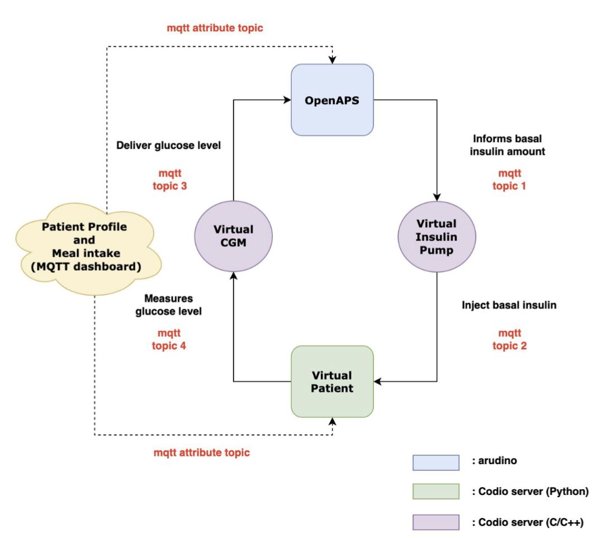

# CIS441-OpenAPS

## How to run the system:

* Run the virtual component and virtual patient on Codio. Upload the OpenAPS code to the Arduino Nano IoT 33.

## Introduction
Approximately 30% - 40% of T1D patients in the US use insulin pumps. This project aims to simulate all the working parts of an OpenAPS system. Specifically, this project utilizes a Python script running on Codio that simulates a patient's current blood glucose level. The blood glucose level is published to the Virtual CGM, which emulates a Continuous Glucose Monitoring system that works to measure the patient’s glucose level and sends it to the OpenAPS system. The OpenAPS component is responsible for processing the incoming glucose values sent through MQTT. The system performs calculations that predict the appropriate insulin rate needed to reach a certain target. That information is then sent to the Virtual Insulin Pump, where it simulates pumping the calculated insulin amount to the patient. The virtual patient dashboard serves to display the glucose level and insulin rate of the patient, allowing for easy visualization. Additionally, other parameters such as meal intake, and bolus insulin can be adjusted. The details will be broken down into the following components.

 
## OpenAPS Component
The OpenAPS system runs on the Arduino Nano 33 IOT. The Arduino program starts by connecting to the WiFi and MQTT broker utilizing the correct credentials. Subsequently, it takes in the current blood glucose(current_BG) and time(current_time) values from the Virtual Insulin CGM by subscribing to MQTT topic3, which is “cis541-2024/Team04/cgm-openaps”. The numerical values are extracted from the MQTT message by utilizing substring methods, which splice on colons, commas, and brackets. Similarly, the patient’s time, dose, and duration information are extracted by subscribing to patient_profile_topic, “tb-proxy/8yj0bip0cpgcurdbgzry/attributes/response/1” and performing string splicing methods.

The core of the OpenAPS system resides in the OpenAPS class. The class performs insulin calculations, blood glucose forecast, and basal rate calculations using methods taught by Professor Lee. These calculations help determine the appropriate insulin rate needed for the patient at any specific moment to help hit a certain level. 

After insulin rate calculations are made, it is published to patient_profile_topic1, which is under the topic of "tb-proxy/8yj0bip0cpgcurdbgzry/attributes/request/1". This allows the dashboard to show the insulin rate alongside the glucose rate. As apparent from the submitted video titled “real_time_plot.mov”, as the glucose level slowly rises above the target level, the insulin level spikes to help keep the glucose level down. 

In order to help avoid blocking or race conditions, the OpenAPS system implemented FreeRTOS to help mitigate conflicts between tasks. All MQTT related tasks are implemented under “TaskMQTT”, while “TaskOpenAPS” implements the necessary data processing and calculations needed to obtain the insulin rate. Semaphores are used to allow sharing of critical resources and variables, such as “dosage_amt”, that are used by both “TaskOpenAPS” and “TaskMQTT”. 

## Virtual Component
The virtual component, which is run on Codio, communicates with both the Virtual Patient and the OpenAPS system. It serves as an intermediary, emulating the data delivery of a real continuous glucose monitor (CGM) and insulin pump. This is done by subscribing to the insulin topic through MQTT, which is "cis541-2024/Team04/insulin-pump-openaps". It is then forwarded to OA_INSULIN_TOPIC, which is "cis541-2024/Team04/insulin-pump-openaps". Additionally, it receives CGM information from "cis541-2024/Team04/cgm", which it publishes to "cis541-2024/Team04/cgm-openaps". This allows the virtual component to simulate handling real time data from the sensor and forwarding it to the OpenAPS system for calculations. 

## Conclusion
This project effectively simulated the functionalities of a real OpenAPS system by replicating the roles of its various components. As demonstrated in the submitted videos, each of the individual components described above is shown to function as intended. Overall, this project provided valuable insights into the complexity of medical devices, particularly in understanding how data is processed, transmitted, and calculated across its different parts.

